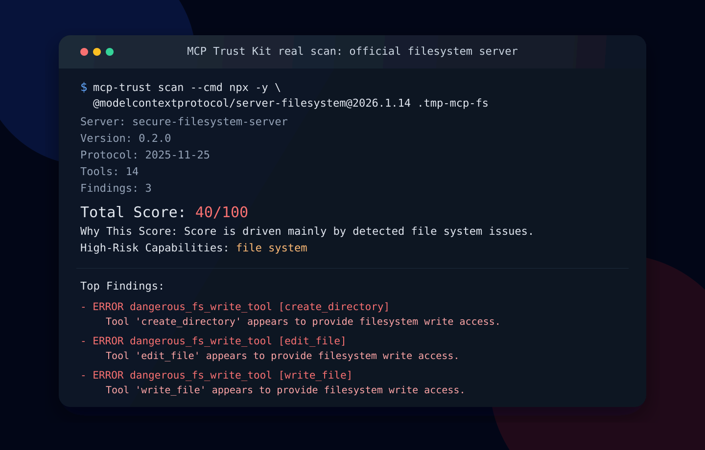

# MCP Scorecard

[](https://github.com/aak204/MCP-Scorecard/actions/workflows/ci.yml)
[](https://github.com/aak204/MCP-Scorecard/releases)
[](LICENSE)
[](https://www.python.org/downloads/)



**Tarjeta de puntuación de calidad determinista y orientada a CI para servidores MCP.**

`MCP Scorecard` es una herramienta de infraestructura de código abierto para revisar servidores MCP antes de que entren en flujos de trabajo reales. Inicia un servidor localmente a través de `stdio`, descubre sus herramientas, aplica un conjunto de reglas determinista y produce puntuaciones y hallazgos revisables en:

- `conformance`
- `security`
- `ergonomics`
- `metadata`

La salida está diseñada para CI: resúmenes estables en terminal, un informe de tarjeta de puntuación JSON legible por máquina y SARIF para sistemas de análisis de código.

Este proyecto intencionalmente no es un envoltorio de IA. No depende de puntuaciones basadas en LLM, juicio oculto o análisis alojado. El objetivo es una línea base repetible y auditable que los equipos de ingeniería pueden usar como puerta de control en solicitudes de extracción (pull requests) y pipelines de lanzamiento.

Valor inmediato:

- ejecútalo localmente contra un servidor MCP real
- falla CI por debajo de un umbral determinista
- exporta JSON y SARIF para automatización
- revisa superficies de MCP de riesgo de forma determinista

## Qué Es

`MCP Scorecard` es una tarjeta de puntuación de calidad determinista para servidores MCP.

Está diseñado para casos en los que los equipos necesitan responder preguntas como:

- ¿Es revisable la superficie de este servidor antes de adoptarlo?
- ¿Expone capacidades que merecen un escrutinio adicional en CI?
- ¿Son los nombres, descripciones y esquemas de las herramientas lo suficientemente claros para una revisión humana?
- ¿Podemos generar un informe legible por máquina estable para automatización y políticas?

Hoy, la herramienta se centra en servidores MCP locales de `stdio` y un modelo de puntuación determinista que es fácil de explicar, probar y versionar.

## Por Qué Existe

Los servidores MCP son infraestructura. Definen superficies de herramientas invocables que agentes, tiempos de ejecución y automatizaciones pueden ejecutar. Esto significa que deben revisarse con la misma seriedad que otros límites de integración.

En la práctica, los equipos suelen evaluar servidores MCP de forma ad hoc:

- las descripciones son vagas
- los esquemas son débiles o poco restrictivos
- las capacidades de alto riesgo se descubren tarde
- CI no tiene una línea base consistente

`MCP Scorecard` convierte esa revisión de primera línea en un contrato determinista:

- ejecútalo localmente
- ejecútalo en CI
- inspecciona puntuaciones por categoría y hallazgos
- exporta JSON y SARIF
- mantén el resultado revisable a lo largo del tiempo

## Qué Verifica

El modelo de puntuación actual utiliza cuatro categorías explícitas.

Conformidad aquí significa verificaciones deterministas de conformidad a nivel de interfaz y revisabilidad de esquemas, no certificación completa del protocolo.

### Conformidad

Verifica si la superficie del servidor está estructuralmente bien formada y es revisable como una interfaz MCP.

Ejemplos:

- nombres de herramientas duplicados
- tipo de esquema faltante
- propiedades arbitrarias de nivel superior
- campos de entrada críticos no marcados como obligatorios

### Seguridad

Verifica capacidades expuestas que aumentan materialmente el radio de explosión (blast radius) o merecen una revisión explícita.

Ejemplos:

- ejecución de comandos
- mutación del sistema de archivos
- primitivas de red y solicitudes HTTP
- patrones de descarga y ejecución

### Ergonomía

Verifica si la superficie del servidor es lo suficientemente comprensible para que humanos y automatizaciones la revisen sin adivinar.

Ejemplos:

- nombres de herramientas excesivamente genéricos
- descripciones vagas
- esquemas de entrada débiles
- herramientas de mutación del sistema de archivos sin indicios visibles de alcance

### Metadatos

Verifica si los metadatos descriptivos básicos están presentes y si el comportamiento destructivo es fácil de detectar.

Ejemplos:

- descripciones de herramientas faltantes
- descripciones que anuncian explícitamente un acceso destructivo amplio

## Lo Que No Promete

`MCP Scorecard` es intencionalmente estrecho y honesto sobre su alcance.

No promete:

- que una puntuación alta signifique que un servidor sea seguro
- que una puntuación baja signifique que un servidor sea malicioso
- análisis de explotabilidad en tiempo de ejecución
- verificación de implementación o aislamiento
- clasificación de intención empresarial
- evaluación de políticas de aprobación humana fuera de la superficie del servidor
- puntuación basada en LLM
- afirmaciones de escaneo alojado o certificación respaldada por registros

La puntuación mide **únicamente propiedades deterministas y revisables**.

Ese es el propósito de la herramienta.

## Inicio Rápido Local

Escanea el servidor de demostración inseguro incluido:

```bash
python -m venv .venv
source .venv/bin/activate
pip install -e .[dev]
mcp-scorecard scan --cmd python examples/insecure-server/server.py
```

Genera JSON y SARIF e impone un umbral de puntuación:

```bash
mcp-scorecard scan \
  --min-score 80 \
  --json-out mcp-scorecard-report.json \
  --sarif mcp-scorecard-report.sarif \
  --cmd python examples/insecure-server/server.py
```

El escáner lanza `--cmd` directamente sin usar un shell. En la práctica, eso significa que `python`, `npx`, `uvx` o un binario compilado pueden funcionar siempre que pases el ejecutable real y sus argumentos.

El nombre preferido de CLI para `v1.0.0` es `mcp-scorecard`. El comando heredado `mcp-trust` permanece disponible como alias de compatibilidad. El módulo de Python permanece como `mcp_trust`.

<details>
<summary>Windows (PowerShell)</summary>

```powershell
python -m venv .venv
.\.venv\Scripts\Activate.ps1
pip install -e .[dev]
.\.venv\Scripts\mcp-scorecard scan --cmd .\.venv\Scripts\python examples\insecure-server\server.py
```

</details>

## Inicio Rápido para GitHub Actions

Agrega este flujo de trabajo a tu repositorio:

```yaml
name: MCP Scorecard

on:
  pull_request:
  workflow_dispatch:

permissions:
  contents: read
  security-events: write

jobs:
  scan:
    runs-on: ubuntu-latest
    steps:
      - uses: actions/checkout@v4

      - name: Run MCP Scorecard
        id: scorecard
        uses: aak204/MCP-Scorecard@v1.0.0
        with:
          cmd: python path/to/your/server.py
          min-score: "80"
          json-out: mcp-scorecard-report.json
          sarif-out: mcp-scorecard-report.sarif
          markdown-out: mcp-scorecard-summary.md

      - name: Use Scorecard Outputs
        if: always()
        run: |
          echo "total score: ${{ steps.scorecard.outputs.total-score }}"
          echo "passed: ${{ steps.scorecard.outputs.passed }}"
          echo 'category scores: ${{ steps.scorecard.outputs.category-scores }}'

      - name: Upload SARIF
        if: always()
        uses: github/codeql-action/upload-sarif@v3
        with:
          sarif_file: mcp-scorecard-report.sarif
```

La acción preserva el caso de uso local actual pero lo empaqueta como un paso de tarjeta de puntuación orientado a CI.

Entradas:

- `cmd`
- `min-score`
- `json-out`
- `sarif-out`
- `markdown-out`

Salidas:

- `total-score`
- `category-scores`
- `passed`

Cada ejecución también escribe un resumen en Markdown apto para PR en el resumen de pasos de GitHub Actions. Si `markdown-out` está configurado, el mismo resumen se escribe en un archivo dentro del espacio de trabajo.

Nota de migración:

- prefiere `aak204/MCP-Scorecard@v1.0.0` en flujos de trabajo nuevos
- las referencias heredadas a `aak204/MCP-Trust-Kit` pueden seguir existiendo en documentos o enlaces antiguos

## Ejemplo de Salida

Salida actual en terminal para [`examples/insecure-server`](examples/insecure-server/README.md):

```text
Generator: MCP Scorecard (mcp-scorecard 1.0.0)
Report Schema: mcp-scorecard-report@1.0
Scan Timestamp: 2026-04-09T15:49:48.930250+00:00
Server: Insecure Demo Server
Version: 0.1.0
Protocol: 2025-11-25
Target: stdio:[".\\.venv\\Scripts\\python","examples\\insecure-server\\server.py"]
Target Description: Local MCP server launched over stdio.
Tools: 4
Finding Counts: total=7, error=2, warning=5, info=0
Total Score: 10/100
Why This Score: Score is driven mainly by security findings in command execution and file system and ergonomics findings.
Score Meaning: Deterministic CI-first quality scorecard based on conformance, security-relevant capabilities, ergonomics, and metadata hygiene.
Category Scores:
- conformance: 90/100 (findings: 1, penalties: 10)
- security: 60/100 (findings: 2, penalties: 40)
- ergonomics: 60/100 (findings: 4, penalties: 40)
- metadata: 100/100 (findings: 0, penalties: 0)
Findings By Bucket:
- security: 2 findings, penalties: 40
  - ERROR dangerous_exec_tool [exec_command]: Tool 'exec_command' appears to expose host command execution.
  - ERROR dangerous_fs_write_tool [write_file]: Tool 'write_file' appears to provide filesystem write access.
- ergonomics: 4 findings, penalties: 40
  - WARNING weak_input_schema [debug_payload]: Tool 'debug_payload' exposes a weak input schema that leaves free-form input underconstrained.
  - WARNING overly_generic_tool_name [do_it]: Tool 'do_it' uses an overly generic name that hides its behavior.
  - WARNING vague_tool_description [do_it]: Tool 'do_it' uses a vague description that does not explain its behavior clearly.
  - WARNING write_tool_without_scope_hint [write_file]: Tool 'write_file' modifies the filesystem without any visible scope hint.
- conformance: 1 finding, penalties: 10
  - WARNING schema_allows_arbitrary_properties [debug_payload]: Tool 'debug_payload' allows arbitrary additional input properties.
Limitations:
- Low score means more deterministic findings or higher-risk exposed surface, not malicious intent.
- High score means fewer deterministic findings, not a guarantee of safety.
```

Artefactos de ejemplo en este repositorio:

- [sample-reports/insecure-server.report.json](sample-reports/insecure-server.report.json)
- [sample-reports/insecure-server.report.sarif](sample-reports/insecure-server.report.sarif)
- [sample-reports/insecure-server.terminal.md](sample-reports/insecure-server.terminal.md)

## Resumen del Modelo de Puntuación

El modelo de puntuación es deliberadamente simple.

1. Comienza en `100`
2. Aplica penalizaciones fijas deterministas por hallazgos
3. Limita las puntuaciones a `0..100`
4. Calcula las puntuaciones por categoría de la misma manera para `conformance`, `security`, `ergonomics` y `metadata`

Mapeo de gravedad en la versión actual:

| Gravedad | Penalización |
| --- | --- |
| `info` | `0` |
| `warning` | `10` |
| `error` | `20` |

Cada verificación incluye metadatos explícitos:

- `id`
- `title`
- `bucket`
- `severity`
- `rationale`

Cada informe expone:

- puntuación total
- puntuaciones por categoría
- contadores de hallazgos
- hallazgos con metadatos completos
- hallazgos agrupados por categoría
- por qué esta puntuación
- significado de la puntuación y limitaciones

Esto mantiene la salida revisable, testeable y estable en CI.

## Formatos de Salida

`MCP Scorecard` actualmente genera cuatro salidas prácticas:

### Resumen en Terminal

Resumen legible por humanos para ejecuciones locales y registros de CI.

### Informe de Tarjeta de Puntuación JSON V1

Formato de informe legible por máquina canónico. La estructura estable de nivel superior V1 es:

- `schema`
- `generator`
- `scan`
- `inventory`
- `scorecard`
- `checks`
- `findings`
- `grouped_findings`
- `metadata`

### SARIF

Para el escaneo de código de GitHub y otros consumidores compatibles con SARIF. SARIF permanece alineado con el modelo de hallazgos actual e incluye metadatos de la tarjeta de puntuación en la ejecución de SARIF.

### Resumen de Paso de GitHub Actions

Resumen en Markdown apto para PR con puntuación total, paso/fallo y puntuaciones por categoría.

JUnit está intencionalmente fuera del alcance para la superficie de la versión actual.

## Qué Significa la Puntuación

La puntuación es una señal de revisión determinista.

- Una puntuación alta no significa seguro
- Una puntuación baja no significa malicioso
- La puntuación mide únicamente propiedades deterministas y revisables

Eso significa que la puntuación es útil como:

- una puerta de control en CI
- una línea base de revisión
- un artefacto de lanzamiento
- una entrada para un juicio de ingeniería más amplio

No es un sustituto de controles en tiempo de ejecución, sandboxing, aislamiento de entorno o aprobación humana.

## Limitaciones

Las limitaciones actuales son explícitas:

- el enfoque principal de transporte es `stdio` local
- las verificaciones son estáticas y deterministas, no dinámicas ni de comportamiento
- el aislamiento en tiempo de ejecución está fuera del alcance
- las afirmaciones de explotabilidad están fuera del alcance
- la intención empresarial está fuera del alcance
- la puntuación basada en LLM está fuera del alcance
- el escaneo alojado está fuera del alcance

Este alcance es intencional. Un contrato determinista más pequeño es más útil en CI que un sistema más amplio pero opaco.

## Instantánea de Escaneo Público

En lugar de tratar tres servidores como un conjunto de validación definitivo, la referencia más útil ahora es el escaneo por lotes completo de `30` servidores MCP públicos:

- [MCP_SCORECARD_30_SERVER_BATCH.md](MCP_SCORECARD_30_SERVER_BATCH.md)
- [MCP_SCORECARD_30_SERVER_BATCH.summary.json](MCP_SCORECARD_30_SERVER_BATCH.summary.json)

Ese lote es el mejor artefacto porque separa:

- servidores que se inician y puntúan correctamente
- servidores que se inician pero exponen problemas de revisión determinista
- servidores que no se inician correctamente en condiciones de CI a ciegas

Ejemplos interesantes seleccionados del lote completo:

| Servidor | Resultado | Por qué es relevante |
| --- | --- | --- |
| `@modelcontextprotocol/server-memory` | `100/100` | línea base oficial limpia bajo las reglas actuales |
| `@modelcontextprotocol/server-filesystem` | `40/100` | la superficie legítima de mutación del sistema de archivos queda claramente expuesta por la tarjeta de puntuación |
| `@modelcontextprotocol/server-everything` | `90/100` | caso de control oficial útil con solo un hallazgo menor de ergonomía |
| `ai.meetlark/mcp-server` | `100/100` | ejemplo de la comunidad compacto que se inicia y puntúa correctamente |
| `ai.social-api/socialapi` | `50/100` | servidor de producto realista con hallazgos orientados a red y un problema de conformidad |
| `capital.hove/read-only-local-postgres-mcp-server` | `90/100` | buen ejemplo de base de datos casi limpio con un pequeño problema de ergonomía de esquema |

El lote completo también brindó una conclusión más honesta: `MCP Scorecard` parece útil, pero el escaneo público reproducible a escala necesita una capa separada de preflight/lanzabilidad.

## Referencias de Salida y Arquitectura

- [docs/architecture.md](docs/architecture.md)
- [MCP_SCORECARD_30_SERVER_BATCH.md](MCP_SCORECARD_30_SERVER_BATCH.md)
- [MCP_SCORECARD_30_SERVER_BATCH.summary.json](MCP_SCORECARD_30_SERVER_BATCH.summary.json)
- [docs/assets/filesystem-scan-hero.svg](docs/assets/filesystem-scan-hero.svg)
- [examples/insecure-server/README.md](examples/insecure-server/README.md)
- [.github/workflows/example.yml](.github/workflows/example.yml)

## Hoja de Ruta

Trabajo a corto plazo después de la superficie de la versión actual:

- expandir verificaciones deterministas en `conformance`, `security`, `ergonomics` y `metadata`
- mejorar el mapeo de ubicación de SARIF cuando el contexto de fuente esté disponible
- agregar más casos de validación del mundo real e informes de ejemplo
- agregar más opciones de transporte una vez que el contrato de puntuación actual se mantenga estable
- limpiar el naming de compatibilidad restante alrededor de referencias de repositorio/paquete/acción

No está en el camino inmediato:

- puntuación basada en LLM en el motor principal
- servicio de tarjeta de puntuación alojado
- integración con registros en el camino de lanzamiento
- afirmaciones de estilo certificación

## Cómo Contribuir

```bash
python -m venv .venv
source .venv/bin/activate
pip install -e .[dev]
python -m pytest
python -m ruff check .
python -m mypy
```

Áreas de contribución recomendadas:

- nuevas verificaciones deterministas con pruebas
- endurecimiento del transporte `stdio`
- mejoras de reporteros que preserven la salida estable
- casos de validación reproducibles
- documentación y artefactos de ejemplo

## Licencia

Apache-2.0. Ver [LICENSE](LICENSE).
