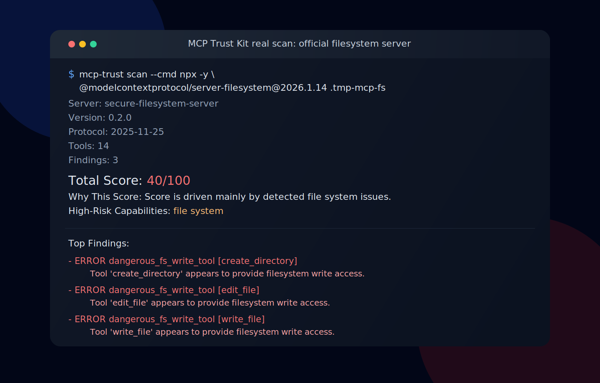

# MCP Trust Kit

[](https://github.com/aak204/MCP-Trust-Kit/actions/workflows/ci.yml)
[](https://github.com/aak204/MCP-Trust-Kit/releases)
[](LICENSE)
[](https://www.python.org/downloads/)



**Deterministic surface-risk scoring for MCP servers.**

`MCP Trust Kit` scans a local MCP server over `stdio`, discovers its tools, runs deterministic
checks for protocol and tool hygiene plus risky exposed capabilities, calculates a score from
`0..100`, and emits terminal, JSON, and SARIF output that fits cleanly into CI. JSON and SARIF
include an explicit `scan_timestamp` field for downstream consumers.

**MCP Trust Kit scores surface risk, not business intent.**

A low score means the exposed tool surface deserves review. It does not mean a server is malicious.
A high score means fewer deterministic findings. It does not mean a server is safe.

## Why

MCP servers expose tools to agents. That makes two questions worth automating before adoption:

- is the server metadata and schema surface clear enough to review?
- does the server expose capabilities with high blast radius?

`MCP Trust Kit` is intentionally narrow. It is not a security platform, a gateway, a hosted
service, or a certification authority. It is a deterministic scanner with stable output.

## What It Checks

Today the scanner penalizes two broad classes of issues:

- protocol and tool hygiene
  duplicate tool names, missing descriptions, vague descriptions, weak schemas, missing schema
  type, arbitrary top-level properties, optional critical fields
- risky exposed capabilities
  command execution, filesystem mutation, network request primitives, download-and-execute patterns

It does **not** score:

- business intent
- runtime isolation and deployment controls
- human approval flows outside the MCP server surface
- exploitability claims

## Quickstart Local

Scan the included insecure demo server:

```bash
python -m venv .venv
source .venv/bin/activate
pip install -e .[dev]
mcp-trust scan --cmd python examples/insecure-server/server.py
```

Generate JSON and SARIF and enforce a score gate:

```bash
mcp-trust scan \
  --min-score 80 \
  --json-out mcp-trust-report.json \
  --sarif mcp-trust-report.sarif \
  --cmd python examples/insecure-server/server.py
```

The scanner launches `--cmd` directly without a shell. In practice that means `python`, `npx`,
`uvx`, or a compiled binary can all work, as long as you pass the real executable name and args.

<details>
<summary>Windows (PowerShell)</summary>

```powershell
python -m venv .venv
.\.venv\Scripts\Activate.ps1
pip install -e .[dev]
.\.venv\Scripts\mcp-trust scan --cmd .\.venv\Scripts\python examples\insecure-server\server.py
```

</details>

## Running Real MCP Servers

Validated examples are documented in [docs/validated-servers.md](docs/validated-servers.md).

Safe-ish public case:

```bash
mcp-trust scan --cmd npx -y @modelcontextprotocol/server-memory@2026.1.26
```

Risky but legitimate public case:

```bash
mkdir -p .tmp-mcp-fs
mcp-trust scan --cmd npx -y @modelcontextprotocol/server-filesystem@2026.1.14 .tmp-mcp-fs
```

On Windows, use `npx.cmd` instead of `npx` when needed.

## GitHub Actions Quickstart

Drop this workflow into your repository:

```yaml
name: MCP Trust Scan

on:
  pull_request:
  workflow_dispatch:

permissions:
  contents: read
  security-events: write

jobs:
  scan:
    runs-on: ubuntu-latest
    steps:
      - uses: actions/checkout@v4

      - name: Run MCP Trust Kit
        uses: aak204/MCP-Trust-Kit@v0.5.0
        with:
          cmd: python path/to/your/server.py
          min-score: "80"
          json-out: mcp-trust-report.json
          sarif-out: mcp-trust-report.sarif

      - name: Upload SARIF
        if: always()
        uses: github/codeql-action/upload-sarif@v3
        with:
          sarif_file: mcp-trust-report.sarif
```

The action fails when:

- the scan fails technically
- the final score is below `min-score`

If the `v0.5.0` tag is not published yet, use a branch name or commit SHA while testing privately.

## Example Output

Current output for [`examples/insecure-server`](examples/insecure-server/README.md):

```text
Server: Insecure Demo Server
Version: 0.1.0
Protocol: 2025-11-25
Target: stdio:[".\\.venv\\Scripts\\python","examples\\insecure-server\\server.py"]
Tools: 4
Findings: 7
Severity: error=2, warning=5, info=0
Total Score: 10/100
Score Meaning: Deterministic surface-risk score based on protocol/tool hygiene and risky exposed capabilities.
Why This Score: Score is driven mainly by detected command execution and file system issues.
High-Risk Capabilities: command execution, file system, external side effects
Review First: write_file, exec_command, debug_payload, do_it
Category Scores:
- spec: 60/100 (penalties: 40)
- auth: 100/100 (penalties: 0)
- secrets: 100/100 (penalties: 0)
- tool_surface: 50/100 (penalties: 50)
Top Findings:
- ERROR dangerous_exec_tool [exec_command]: Tool 'exec_command' appears to expose host command execution.
- ERROR dangerous_fs_write_tool [write_file]: Tool 'write_file' appears to provide filesystem write access.
- WARNING schema_allows_arbitrary_properties [debug_payload]: Tool 'debug_payload' allows arbitrary additional input properties.
- WARNING weak_input_schema [debug_payload]: Tool 'debug_payload' exposes a weak input schema that leaves free-form input underconstrained.
- WARNING overly_generic_tool_name [do_it]: Tool 'do_it' uses an overly generic name that hides its behavior.
Score Limits:
- Low score means higher exposed surface risk, not malicious intent.
- High score means fewer deterministic findings, not a guarantee of safety.
```

Sample launch artifacts generated from the current scanner:

- [sample-reports/insecure-server.report.json](sample-reports/insecure-server.report.json)
- [sample-reports/insecure-server.report.sarif](sample-reports/insecure-server.report.sarif)
- [sample-reports/insecure-server.terminal.md](sample-reports/insecure-server.terminal.md)

## Rule Categories

The scoring model currently exposes four top-level score buckets:

- `spec`
- `auth`
- `secrets`
- `tool_surface`

The findings themselves are also grouped into capability-aware risk categories:

- `metadata_hygiene`
- `schema_hygiene`
- `command_execution`
- `file_system`
- `network`
- `external_side_effects`

Current deterministic rules:

- `duplicate_tool_names`
- `missing_tool_description`
- `overly_generic_tool_name`
- `vague_tool_description`
- `missing_schema_type`
- `schema_allows_arbitrary_properties`
- `weak_input_schema`
- `missing_required_for_critical_fields`
- `dangerous_exec_tool`
- `dangerous_shell_download_exec`
- `dangerous_fs_write_tool`
- `dangerous_fs_delete_tool`
- `dangerous_http_request_tool`
- `dangerous_network_tool`
- `write_tool_without_scope_hint`
- `tool_description_mentions_destructive_access`

## Scoring

The scoring model is intentionally simple and predictable:

1. start at `100`
2. subtract fixed penalties for findings
3. clamp to `0..100`
4. compute category scores the same way

Severity mapping in `v0.5.0`:

| Severity | Penalty |
| --- | --- |
| `info` | `0` |
| `warning` | `10` |
| `error` | `20` |

The score is meant to be reviewable, stable, and easy to reason about in CI.

## Validated On Real MCP Servers

Validation date: `2026-03-29`

| Server | Source | Result | Notes |
| --- | --- | --- | --- |
| `examples/insecure-server` | local demo | `10/100` | intentionally risky deterministic fixture |
| `@modelcontextprotocol/server-memory@2026.1.26` | official public package | `100/100` | no findings under current deterministic rules |
| `@modelcontextprotocol/server-filesystem@2026.1.14` | official public package | `40/100` | legitimate filesystem mutation surface is flagged as risky |

Commands, caveats, and findings:

- [docs/validated-servers.md](docs/validated-servers.md)

## Architecture

```text
stdio transport -> normalization -> rules registry -> scoring engine -> terminal / JSON / SARIF
```

More detail:

- [docs/architecture.md](docs/architecture.md)

## Examples And Docs

- [examples/insecure-server/README.md](examples/insecure-server/README.md)
- [examples/fake_stdio_server.py](examples/fake_stdio_server.py)
- [docs/validated-servers.md](docs/validated-servers.md)
- [docs/architecture.md](docs/architecture.md)
- [docs/assets/filesystem-scan-hero.svg](docs/assets/filesystem-scan-hero.svg)
- [.github/workflows/example.yml](.github/workflows/example.yml)

## Ecosystem & Complementary Tools

`MCP Trust Kit` is designed as a **Layer 1 (Static Risk)** scanner. For a complete agentic DevSecOps pipeline, we recommend pairing it with runtime observability tools:

* [**Veridict**](https://github.com/xkumakichi/veridict) (Layer 2 - Runtime Trust): A lightweight middleware that logs actual tool executions and gives a trust verdict based on real execution history. While MCP Trust Kit answers *"Is the blast radius structurally safe?"*, Veridict answers *"Is the server actually reliable in production?"*.

## Roadmap

Near-term work after `v0.5.0`:

- expand deterministic rules for `auth` and `secrets`
- improve SARIF location mapping when source context is available
- add more real-world validation cases and sample reports
- add more transport options once the current scoring surface stays stable

Not on the immediate path:

- LLM-based scoring in the core engine
- hosted scanning
- registry integration in the release path
- certification-style claims

## Contributing

```bash
python -m venv .venv
source .venv/bin/activate
pip install -e .[dev]
python -m pytest
python -m ruff check .
python -m mypy
```

Good contribution areas:

- new deterministic rules with tests
- `stdio` transport hardening
- reporter improvements that preserve stable output
- docs and reproducible validation cases

## License

Apache-2.0. See [LICENSE](LICENSE).
