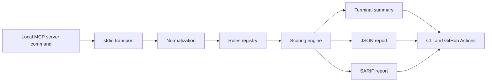

# Architecture

`MCP Trust Kit` keeps the `v0.4.0` pipeline intentionally small and deterministic.

Key properties:

- one MCP transport for `v0.4.0`: local `stdio`
- one deterministic rule per file
- one deterministic surface-risk scoring engine
- output layer formats an already-built `Report`
